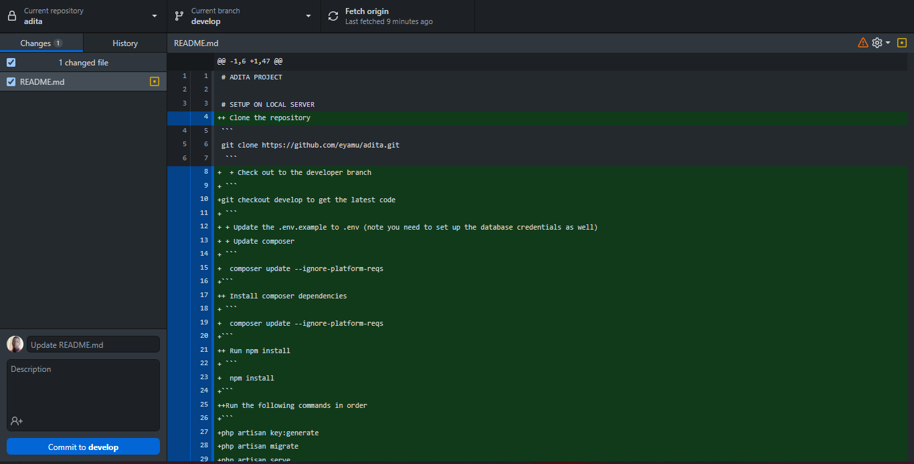

<<<<<<< HEAD
# ADITA PROJECT
+ Please follow this link to view the project documenation
<a href="https://docs.google.com/document/d/19v-1hQWan-G8jN6NihmNzmTsG0TQvd8q8DqgJBet63s/edit?usp=sharing" >Documentation</a>
# RULES
+ Please remember to document any changes you make that affect the project structure
+ These changes include tables , fields and the architecture you are using
+ Always use dump data or settings so that the project doesnot have alot of bugs

# SETUP ON LOCAL SERVER
+ Clone the repository
```
git clone https://github.com/eyamu/adita.git
 ``` 
  + Check out to the developer branch
 ```
git checkout develop to get the latest code
 ``` 
 + Update the .env.example to .env (note you need to set up the database credentials as well)
 + Update composer 
 ```
  composer update --ignore-platform-reqs
```
+ Install composer dependencies
 ```
  composer update --ignore-platform-reqs
```
+ Run npm install
 ```
  npm install
```
+ Run the following commands in order
```
php artisan key:generate
php artisan migrate
php artisan serve
```
- In case you are working on image uploads and you need to render the uploaded image use the command below.
```
php artisan storage:link
```
+ To watch changes in the resources(run this in a seperate terminal dont kill the server)
```
npm run watch
```
# BRANCHING
+ Once everything is set up please remember to branch off
+ Please branch naming follows this pattern f-branch_name_module for example f-payments_module 
+ To create a branch run the following 
```
git checkout -b f-branch_name_module
```

# COMMITING DURING DEVELOPMENT
+ Please its advisable we all install github desktop for better and meaning commit messages

+ I have shared a screenshoot of a github desktop
> The following are the commit messages to be used :create, update, delete, fix,restored , edit
+ An example of a commit messages
>update - updated cards on a dashboard so that they match our primary colour


# CREATING PULL REQUESTS
+ Once you push code to your branch please create a
  pull request from based on the develop branch
+ Make sure you dont gave any merge conflicts
+ Incase of any conflicts please resolve them locally 
+ Pull from the develop branch and merge locally on your computer
+ Push back the code

# MERGING THE CODE ON GITHUB
+ Merging is only to a few specified people !! 
+ Please dont just merge if your not supposed to
